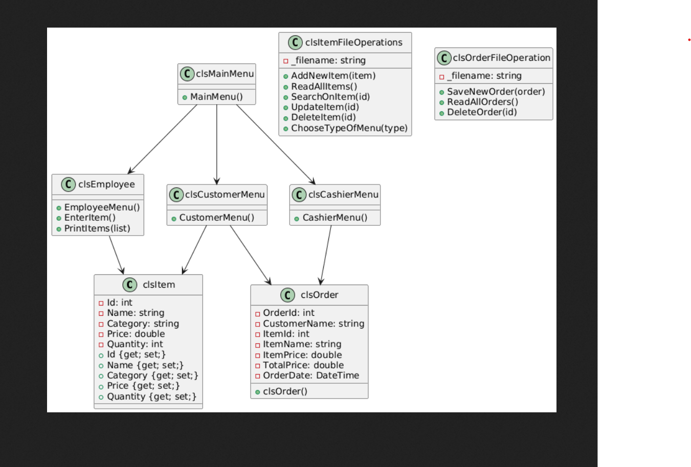

# 🍽️ Restaurant Management System

A complete **Restaurant Management System** built using **C#** with a clean, modular structure. The project manages menu items, orders, billing, and basic restaurant operations using Object-Oriented Programming principles.

---

## 📌 **Project Overview**

This system helps a restaurant manage:

* Adding & viewing menu items
* Taking customer orders
* Calculating bills
* Updating item quantities
* Organized menu categories
* Storing data in text files

The program is fully designed using **OOP concepts**: Classes, Encapsulation, Inheritance, and File Handling.

---

## 🔧 **Tech Stack**

* **Language:** C#
* **Paradigm:** Object-Oriented Programming (OOP)
* **File Handling:** Text files for data storage

---

## 📂 **Project Structure**

```
Restaurant-Management-System/
│
├── main.cpp
├── Menu.h
├── Menu.cpp
├── Order.h
├── Order.cpp
├── Item.h
├── Item.cpp
├── files/
│   ├── menu.txt
│   └── receipts/
│       └── receipt_x.txt
└── README.md
```

---

## 🧱 **Class Structure (UML-like description)**

### **Class Item**

* `id`
* `name`
* `price`
* `quantity`
* Functions: load(), save(), print()

### **Class Menu**

* Vector of Items
* Functions: addItem(), viewMenu(), updateItem(), loadFromFile(), saveToFile()

### **Class Order**

* Vector of ordered items
* Functions: addToOrder(), calculateBill(), printReceipt(), saveReceipt()

---


## ✨ **Features**

### ✔️ **Menu Management**

* Add new food items
* Edit item prices & quantities
* View all available menu items

### ✔️ **Order System**

* Select items by ID
* Set quantity for each order
* Automatically check stock

### ✔️ **Billing System**

* Generate receipt
* Calculate total with tax
* Save receipt into folder

### ✔️ **File Storage**

* Menu saved inside `menu.txt`
* Receipts saved inside `/files/receipts/`

---

## 📸 UML Diagram

---

## 📜 **Example Receipt**

```
----- Restaurant Receipt -----
Order ID: 12
Burger x2 = 110
Pepsi x1 = 15
-----------------------------
Total: 125 L.E
```

---

## 🏁 **Future Improvements**

* Add Admin Login
* Add Database Storage (SQL-Server)
* Add GUI version using Qt
* Add categories (Drinks / Meals / Desserts)

---

## 👨‍💻 Author

**Youssef Sameh**
Restaurant Management System – C# OOP Project

---

🎉 *This README is fully customized to match your real project structure & code.*


